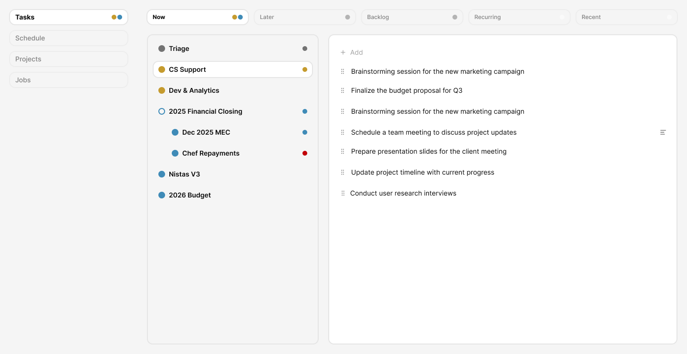
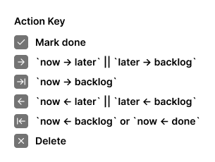
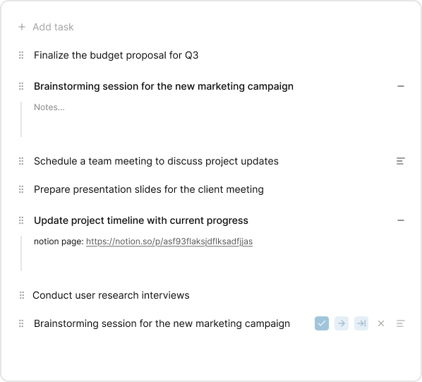
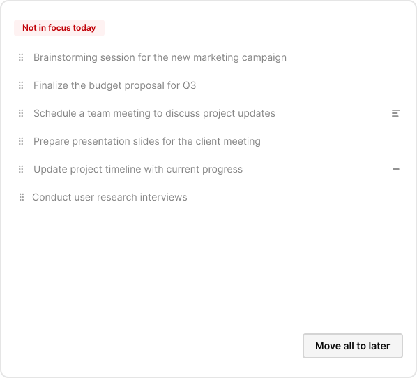
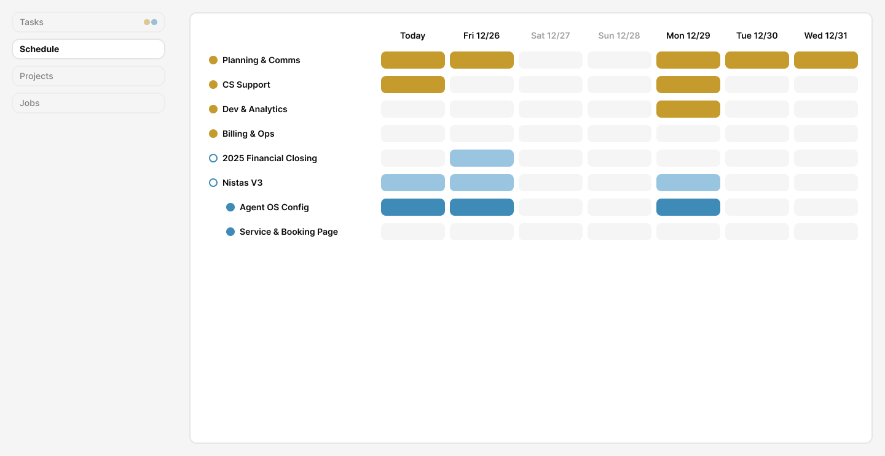
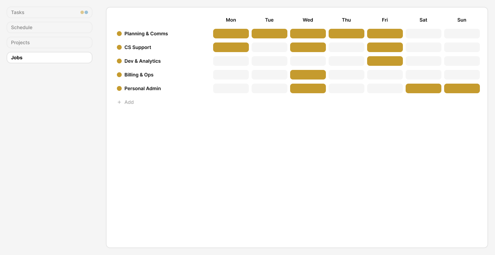
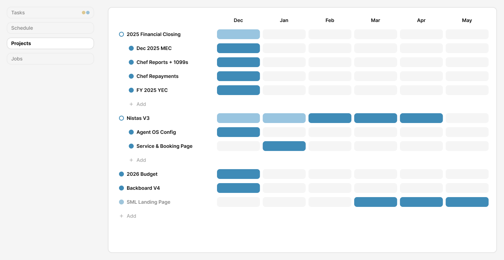
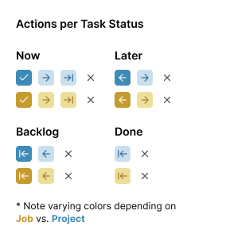
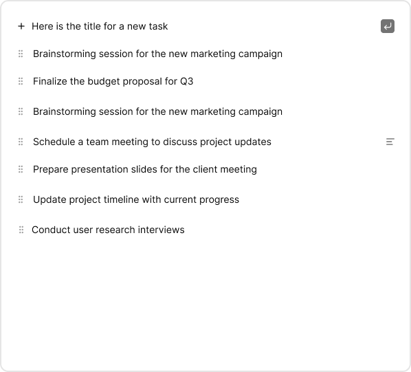
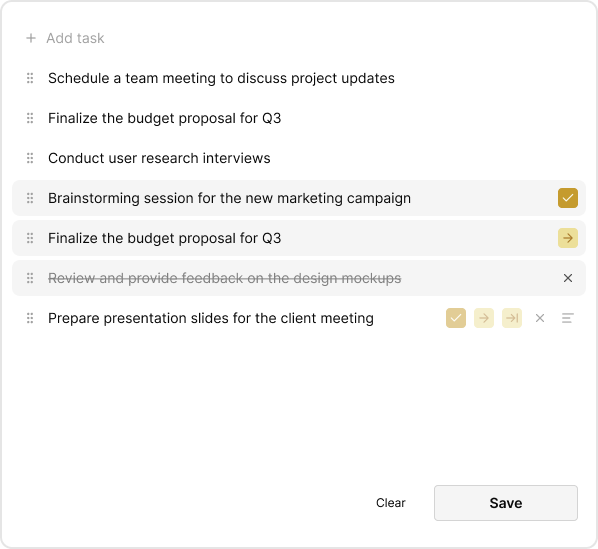

# Backboard V4 – Product Requirements Document

## 1. Product Vision

**Backboard** is a lightweight, local-first task management tool focused on **what's current** – not historical data. Users can start immediately without an account, with all data stored locally. Account creation enables cross-device sync.

### Design Philosophy

- **Ephemeral by design**: Done tasks purge after 7 days, archived scopes clear after 30 days
- **Focused time horizons**: 7-day schedule view, 6-month project timeline
- **No infinite backlog**: The tool is for NOW and the attainable future
- **Desktop + Mobile**: MVP targets both desktop and mobile experiences

### Figma Source

[Backboard V4 Figma File](https://www.figma.com/design/rLqYom1JI7nWHmwnLX34Ij/Backboard-V4)

---

## 2. Core Concepts

### 2.1 Scopes

| Type | Description | Scheduling |
|------|-------------|------------|
| **Job** | Recurring work category | Weekly template → auto-populates 7-day schedule |
| **Project** | Time-bound initiative (1-level nesting) | Monthly allocation (toggle active months) |
| **Triage** | Quick capture bucket (`scopeId: null`) | N/A – tasks move OUT only |

### 2.2 Task Lifecycle

```
[Quick capture] → Triage
                     ↓ (drag to scope)
Recurring ──(hourly cron)──→ Now → Later → Backlog → Done
                                                       ↓
                                            (purge after 7 days)
```

| List | Behavior |
|------|----------|
| **Triage** | Unscoped tasks; exit-only (drag to a Job/Project). Always visible in Now/Later/Backlog. Not visible in Recurring. Only visible in Recent if has tasks. |
| **Recurring** | Templates with frequency; hourly cron inserts into Now at scheduled time |
| **Now** | Today's active work |
| **Later** | Near-term queue |
| **Backlog** | Parked for future |
| **Done (Recent)** | Last 7 days; auto-purged after. Scopes only visible if they have tasks. |

### 2.3 Scheduling

| Entity | Horizon | Behavior |
|--------|---------|----------|
| **DefaultScheduleSlot** | Weekly template | "Job X on Mon/Wed/Fri" – nightly cron creates ScheduleSlots |
| **ScheduleSlot** | Next 7 days | Click cells to toggle Scope active on a day |
| **MonthSlot** | Next 6 months | Click cells to toggle Project active in a month (non-consecutive OK) |

**Week starts on Monday.**

---

## 3. Data Model

```typescript
type TaskStatus = "now" | "later" | "backlog" | "done"
type TasklistType = TaskStatus | "recurring"

type BaseTask = {
  id: string
  title: string
  content?: string        // Rich text (notes)
  createdAt: number       // UTC Milliseconds
}

type Task = BaseTask & {
  pendingAction?: TaskStatus | "delete"
  insertedAt: number
  insertedFrom: TasklistType  // For undo & metadata display
}

type FrequencyValue = {
  weekday: Weekday
  time: string            // HH:mm
  timezone: string        // e.g., America/New_York (auto-detect, user-editable)
}

type RecurringTask = BaseTask & {
  frequency: FrequencyValue[]
}

type TaskOrRecurringTask = Task | RecurringTask

type Tasklist<T = TasklistType> = {
  scopeId: string | null  // null = Triage
  type: T
  tasks: T extends "recurring" ? RecurringTask[] : Task[]
}

type BaseScope = {
  id: string
  type: "job" | "project"
  title: string
  content?: string         // Rich text (opened in modal)
  createdAt: number       // UTC Milliseconds
  archivedAt: number      // UTC Milliseconds (0 = not archived)
}

type Job = BaseScope & {
  type: "job"
}

type Project = BaseScope & {
  type: "project"
  parentId: string        // Only 1 level of nesting permitted
}

type Scope = Job | Project

type Weekday = "mon" | "tue" | "wed" | "thu" | "fri" | "sat" | "sun"

type ScheduleSlot = {
  id: string
  date: string            // YYYY-MM-DD
  weekday: Weekday
  scopeId: string
}

type MonthSlot = {
  id: string
  month: string           // YYYY-MM
  projectId: string
}

type DefaultScheduleSlot = {
  id: string
  weekday: Weekday
  jobId: string
}
```

---

## 4. Pages & Features

### 4.1 Tasks Page



- **Left sidebar**: Scope selector (all Jobs + Projects)
- **Triage**: Always visible at top (in Now/Later/Backlog) for quick capture
- **Tasklists**: Now / Later / Backlog / Recurring / Recent
- **Interactions**:
  - Drag tasks between scopes (including out of Triage – but never INTO Triage)
  - Drag to reorder within lists
  - Quick actions: ✅ Done, ➡️ Later, ⏭️ Backlog, ⬅️ Pull back, ✖️ Delete
  - Expandable inline notes (rich text)
  - Metadata on expand: "created at", "moved from"
- **Batch save**: `pendingAction` → Save commits, Clear reverts

#### Task Actions by Status



| Action | Icon | Effect |
|--------|------|--------|
| Mark done | ✓ | Move to Done |
| Move forward | → | now→later, later→backlog |
| Skip ahead | →\| | now→backlog |
| Pull back | ← | later→now, backlog→later, done→now |
| Delete | × | Permanent deletion |

**Note**: Action icon colors vary by scope type (gold = Job, blue = Project).

#### Expandable Notes



Tasks can have inline expandable notes with rich text content.

#### Unfocused Scope Warning



When a Scope has tasks in "Now" but is **not scheduled for today** (no ScheduleSlot for today's date), the UI displays a warning state:

- **Red label**: "Not in focus today"
- **Bulk action**: "Move all to later" button
- Tasks are still visible and actionable, but the UI nudges the user to clear them

This is a **destructive hint** pattern – guiding users that these tasks shouldn't be in "Now" because the scope isn't in focus today. The goal is to help users maintain a clean, focused task list aligned with their schedule.

**Trigger condition**: Scope has `status: "now"` tasks AND no `ScheduleSlot` exists where `date === today` AND `scopeId === scope.id`.

### 4.2 Schedule Page (7-Day View)



- **Columns**: Today → +6 days
- **Rows**: ALL non-archived Scopes + Projects active in current month (if week spans months, show projects active in EITHER month)
- **Interaction**: Click cell to toggle ScheduleSlot
- **Color coding**: 🟡 Gold = Job, 🔵 Blue = Project
- **Auto-population**: Nightly cron fills from DefaultScheduleSlot

### 4.3 Jobs Page



- **Dual purpose**: List of Jobs + Weekly template editor
- **Left panel**: Job list with "+ Add" inline
- **Right panel**: 7-day grid (Mon–Sun)
- **Interaction**: Click cells to set DefaultScheduleSlot
- **Job detail**: Click Job name → Modal with rich text content

### 4.4 Projects Page (6-Month Timeline)



- **Dual purpose**: List of Projects + Monthly timeline
- **Left panel**: Project list (nested children indented) with "+ Add"
- **Right panel**: 6-month grid (This month → +5)
- **Interaction**: Click cells to toggle MonthSlot (non-consecutive allowed)
- **Project detail**: Click Project name → Modal with rich text content

### 4.5 Archive Page

*(Not yet designed)*

- Simple list of archived Scopes (Jobs + Projects)
- **Unarchive** button per item
- Auto-purge after 30 days

### 4.6 Modals

*(Not yet designed)*

| Modal | Trigger | Content |
|-------|---------|---------|
| **Scope Detail** | Click scope name | Rich text editor for `content` |
| **Recurring Frequency** | Edit recurring task | Weekday picker, time, timezone (auto-detect default) |
| **Archive Confirmation** | Archive a scope | "Move tasks to Triage" or "Archive with scope" |

---

## 5. Background Jobs → Local Sync

Since Backboard is **local-first**, traditional server-side cron jobs don't apply. Instead, all background tasks run **client-side on app launch** (and optionally via a manual "Sync" button).

### On App Launch / Sync

When the user opens the app (or triggers sync), the following jobs run locally:

| Job | Logic |
|-----|-------|
| **Recurring inserter** | Check RecurringTasks; if current time ≥ scheduled `time` and task hasn't been inserted today, insert into "Now" |
| **Schedule populator** | For each Job with DefaultScheduleSlots, ensure ScheduleSlots exist for the next 7 days |
| **Done purge** | Delete tasks with `status: done` where `completedAt < now - 7 days` |
| **Archive purge** | Delete Scopes where `archivedAt < now - 30 days` |

### Implementation Notes

- Jobs should be **idempotent** – running multiple times produces the same result
- Track `lastSyncedAt` timestamp to optimize recurring task insertion (avoid duplicates)
- Consider showing a brief "Syncing..." indicator on app launch
- Optional: Add a manual "Sync" button in the UI for users who leave the app open for extended periods

---

## 6. Data Lifecycle

```
┌─────────────────────────────────────────────────────────┐
│                    ACTIVE DATA                          │
│  Jobs, Projects, Tasks (now/later/backlog/recurring)    │
└─────────────────────────────────────────────────────────┘
                          ↓ (complete task)
┌─────────────────────────────────────────────────────────┐
│                 DONE (7-day window)                     │
│              Visible in "Recent" list                   │
└─────────────────────────────────────────────────────────┘
                          ↓ (7 days)
                    [PERMANENTLY DELETED]

┌─────────────────────────────────────────────────────────┐
│               ARCHIVED (30-day window)                  │
│        Scopes only; visible on Archive page             │
└─────────────────────────────────────────────────────────┘
                          ↓ (30 days)
                    [PERMANENTLY DELETED]
```

### Deletion Rules

- **Tasks**: Permanently deleted (via delete action or 7-day purge)
- **Scopes**: Archived only (never hard-deleted by user), auto-purged after 30 days

---

## 7. Technical Requirements (MVP)

### 7.1 Local-First Architecture

- **No account required** to start using the app
- All data persisted to local storage (IndexedDB or similar)
- Account creation enables **cloud sync** across devices
- Offline-capable; sync on reconnect

### 7.2 Data Storage Philosophy

- Minimal data retention by design
- No infinite history – focus on current state
- Purge schedules enforce ephemerality
- **Storage warning UI** when approaching local storage limits

### 7.3 Sync Considerations (Post-MVP)

- Conflict resolution strategy for multi-device edits (TBD)
- Sync scope: active data only (done tasks and archived scopes may not sync)

### 7.4 Mobile Support (MVP)

The Figma designs provided are **desktop layouts only**. However, mobile support is required for MVP.

**Guidance for implementers:**

- Build with **responsive design** from the start
- All pages should adapt to mobile viewport sizes
- Consider mobile-first patterns where appropriate:
  - Tasks Page: Full-screen tasklist, scope selector as collapsible drawer or bottom sheet
  - Schedule Page: Horizontal scroll or single-day view with day picker
  - Projects/Jobs Pages: Stack list and timeline vertically, or use tabs
- Touch-friendly interactions: larger tap targets, swipe gestures for task actions
- No separate mobile designs provided – implementers should use best judgment

---

## 8. Open Design Work

| Item | Status |
|------|--------|
| Scope Detail Modal | Not designed |
| Recurring Frequency Modal | Not designed |
| Archive Confirmation Dialog | Not designed |
| Archive Page | Not designed |
| Empty states (no tasks, no scopes) | Not designed |
| Onboarding / first-run experience | Not designed |
| Storage limit warning UI | Not designed |
| **Mobile layouts (all pages)** | Not designed – implementer discretion |
| Sync indicator / button | Not designed |

---

## 9. Visual Reference

### Page: Tasks


### Page: Schedule  


### Page: Projects


### Page: Jobs


### Component: Task Actions


### Component: Actions per Status


### Component: Expandable Notes


### Component: Adding a Task


### Component: Pending Actions


### Component: Unfocused Scope Warning

